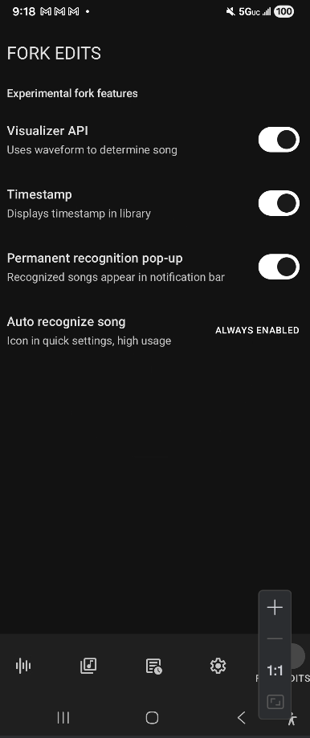
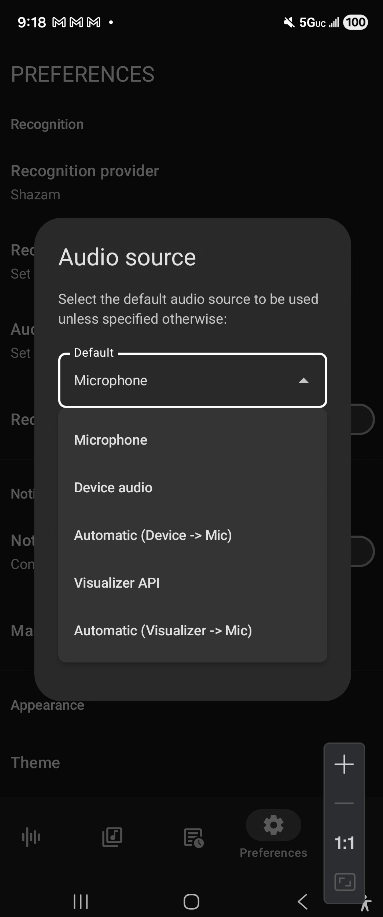

# Audile-experimental

Added some more functionality to the original Audile app such as adding timestamps, an auto-recognize quick icon button, and better notification functionality. All original credits go to the owner here https://github.com/aleksey-saenko/MusicRecognizer and you can see all the changes I made by looking at my forkchanges.md file.

**Link to releases:** [https://gitlab.com/bearincrypto1/audilemodded/-/releases](https://gitlab.com/bearincrypto1/audilemodded/-/releases)

## Get from source

```bash
git clone https://gitlab.com/bearincrypto1/audilemodded.git
```

## Modded Code

```
com.mrsep.musicrecognizer/
└── FORKEDITS/                         # All mod-specific code
    ├── AutoRecognitionService.kt      # Background recognition service for auto-recognize function
    ├── AutoRecognitionTileService.kt  # Quick settings auto-recognize tile
    ├── ForkEditsScreen.kt             # Fork settings UI
    ├── ForkEditsViewModel.kt          # Fork settings logic
    └── forkchanges.md                 # Complete log of changes to the original audile codebase
```

## Screenshots

 

## License

This project is licensed under the GPL-3.0 License - see the [LICENSE](LICENSE.md) file for details.

## Credits

Based on [Audile](https://github.com/aleksey-saenko/MusicRecognizer) by aleksey-saenko.
